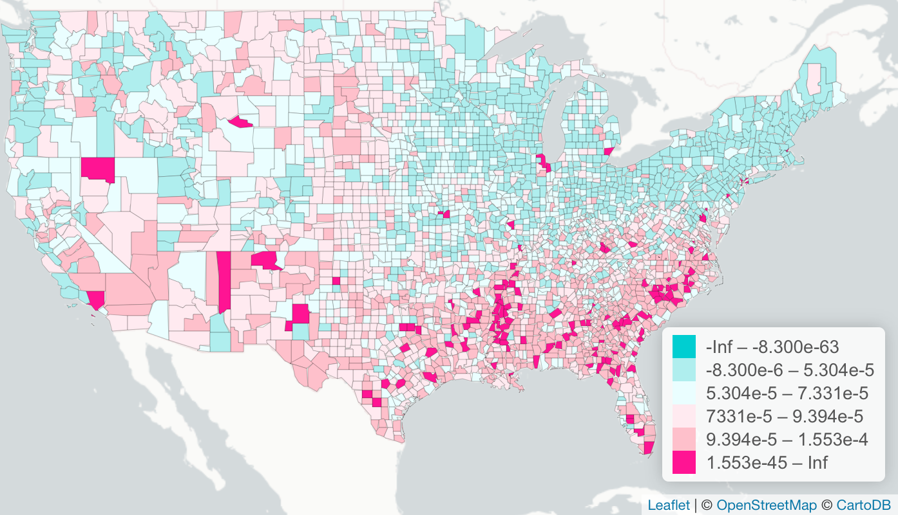

```{r coefnames, eval=FALSE, include=FALSE}
M0Z
M3Z
M4Z
M4ZxD
M5Int
M5Res
M5Imm
M5Dis
M5Men
M5Min
M6SLag
M6Int
M6Res
M6Imm
M6Men
M6Dis
M6Min
M7Err
M7Int
M7Res
M7Imm
M7Men
M7Dis
M7Min
```

```{r setup}
library(sp)
library(rgdal)
library(leaflet)
library(htmltools)
library(RColorBrewer)
```

```{r read_data, message=FALSE, warning=FALSE,echo=FALSE,include=FALSE}
counties <- readOGR('/Users/erin/Google Drive/School/Thesis/Climate change & weather/Viz/HR90/hr90.shp')
zones <- readOGR('data/climatezones_aug.shp',layer='climatezones_aug', GDAL1_integer64_policy = TRUE)
```

```{r filter_spatial_models}
zones@data[!zones$zone%in%c(8,14,20),10:15] <- NA
zones@data[!zones$zone%in%c(2,3,5,7,18),16:22] <- NA
zones@data[!zones$zone%in%c(1,6,7,10,11,12,13),23:29] <- NA
```

```{r build_palettes}
m0.bins = c(-Inf,-6.0,-1.5,-.0001,0.0001,1.5,6.0,Inf)
m0.pal <- colorBin('RdBu', domain = zones$M0Z, bins = m0.bins, reverse=TRUE)

m3.bins = c(-Inf,-.812,-.527,0,0.0001,.326,.611,Inf)
m3.pal <- colorBin('RdBu', domain = zones$M3Z, bins = m3.bins, reverse=TRUE)

m4.bins.zone = c(-Inf,-.640,-.228,-.038,0.0001,.236,.646,Inf)
m4.pal.zone <- colorBin('RdBu', domain = zones$M4Z, bins = m4.bins.zone, reverse=TRUE)

m4.bins.int = c(-Inf,-.236,-.059,0,0.001,0.3,0.620,Inf)
m4.pal.int <- colorBin('RdBu', domain = zones$M4ZxD, bins = m4.bins.int, reverse=TRUE)

m5.int.bins <- seq(min(na.omit(zones$M5Int)),max(na.omit(zones$M5Int)),by=(max(na.omit(zones$M5Int)) - min(na.omit(zones$M5Int)))/7)
m5.int.pal <- colorBin('YlOrRd', domain = zones$M5Int, bins = m5.int.bins, reverse=FALSE)
  
m5.dis.bins <- seq(min(na.omit(zones$M5Dis)),max(na.omit(zones$M5Dis)),by=(max(na.omit(zones$M5Dis)) - min(na.omit(zones$M5Dis)))/7)
m5.dis.pal <- colorBin('YlOrRd', domain = zones$M5Dis, bins = m5.dis.bins, reverse=FALSE)

m6.dis.bins <- seq(min(na.omit(zones$M6Dis)),max(na.omit(zones$M6Dis)),by=(max(na.omit(zones$M6Dis)) - min(na.omit(zones$M6Dis)))/7)
m6.dis.pal <- colorBin('YlOrRd', domain = zones$M6Dis, bins = m6.dis.bins, reverse=FALSE)

m7.dis.bins <- seq(min(na.omit(zones$M7Dis)),max(na.omit(zones$M7Dis)),by=(max(na.omit(zones$M7Dis)) - min(na.omit(zones$M7Dis)))/7)
m7.dis.pal <- colorBin('YlOrRd', domain = zones$M7Dis, bins = m7.dis.bins, reverse=FALSE)
```

```{r prepare_labels_and_map}
base.labels <- sprintf(
  "<strong>%s</strong><br/>",
  zones$Name
) %>% lapply(HTML)

m0.labels <- sprintf(
  "<strong>%s</strong><br/>Base Coefficient:  %g",
  zones$Name, zones$M0Z
) %>% lapply(HTML)

m3.labels <- sprintf(
  "<strong>%s</strong><br/>Model A Zone Coefficient:  %g",
  zones$Name, zones$M3Z
) %>% lapply(HTML)

m4.labels <- sprintf(
  "<strong>%s</strong><br/>Model B Zone Coefficient:  %g",
  zones$Name, zones$M4Z
) %>% lapply(HTML)

m4.int.labels <- sprintf(
  "<strong>%s</strong><br/>Model B Zone x Disadvantage Coefficient:  %g",
  zones$Name, zones$M4ZxD
) %>% lapply(HTML)

m5.int.labels <- sprintf(
  "<strong>%s</strong><br/>Model C (OLS by Regimes) Intercept Coefficient:  %g",
  zones$Name, zones$M5Int
) %>% lapply(HTML)

m5.dis.labels <- sprintf(
  "<strong>%s</strong><br/>Model C (OLS by Regimes) Disadvantage Coefficient:  %g",
  zones$Name, zones$M5Dis
) %>% lapply(HTML)

m6.dis.labels <- sprintf(
  "<strong>%s</strong><br/>Model D (Spatial Lag by Regimes) Disadvantage Coefficient:  %g",
  zones$Name, zones$M6Dis
) %>% lapply(HTML)

m7.dis.labels <- sprintf(
  "<strong>%s</strong><br/>Model E (Spatial Error by Regimes) Disadvantage Coefficient:  %g",
  zones$Name, zones$M7Dis
) %>% lapply(HTML)

hopts <- highlightOptions(weight = 4,
                       color = "#555555",
                       dashArray = "",
                       fillOpacity = .6,
                       bringToFront = TRUE)

lopts <- labelOptions(style = list("font-weight" = "normal"),
                      textsize = "15px",direction = "auto",opacity=1)

zones.map <- leaflet(zones,option=leafletOptions(zoomControl=TRUE,minZoom=4, maxZoom=5)) %>%
               addProviderTiles(providers$CartoDB.PositronNoLabels) %>%
               addLabelOnlyMarkers(lng = ~Lon, lat = ~Lat, label = ~as.character(zone),
                                     labelOptions = labelOptions(noHide = TRUE, direction = 'top', textOnly = TRUE,
                                                  style = list("font-size" = "14px")))
```

### Introduction {data-commentary-width=450}

<p align=center><font size=3>
Figure 1. Homicide rate per 100,000 persons by county, 1990, with Empirical Bayes smoothing
(data from <a href=https://geodacenter.github.io/data-and-lab/ncovr>Anselin 2003</a>).</font><br>
```{r frame1}
#{width=1000px}
hr90.colors <- c('darkturquoise','paleturquoise','#eafeff','#ffeaf0','pink','deeppink')
hr90.bins <- c(-Inf,-8.300e-6,5.304e-5,7.331e-5,9.394e-5,1.553e-4,Inf)

hr90.pal <- colorBin(hr90.colors, domain = counties$EBS_HR90, bins = hr90.bins)

leaflet(counties,option=leafletOptions(zoomControl=TRUE,minZoom=4, maxZoom=7)) %>% 
        addProviderTiles(providers$CartoDB.PositronNoLabels) %>%
        addPolygons(fillColor = ~hr90.pal(counties$EBS_HR90),weight = .25,
                    opacity = .5,color = 'black',fillOpacity = 1) %>%
        addLegend(colors=hr90.colors, values=~counties$EBS_HR90, opacity = 1, title = NULL,position='bottomright',
                  labels=c('-Inf - -8.300e-63','-8.300e-6 - 5.304e-5','5.304e-5 - 7.331e-5','7.331e-5 - 9.394e-5',
                           '9.394e-5 - 1.553e-4','1.553e-45 - Inf'))
```
</p>

*** 
<p align=justify><font size=4>
<b>Violence rates are higher in the South.</b><br><br>
Historically, criminologists have turned to the idea of a <i>Southern subculture of violence</i> to explain this disparity.<br><br>
But culture isn't the only factor that varies regionally: the <u>climate</u> does, too.</font></p>

### Climate Regions {data-commentary-width=450}
<p align=center><font size=3>
Figure 2. Climate regions where sampled tracts are located.</font><br>
```{r frame2}
zones.map %>% addPolygons(weight = 1, color = '#000000',opacity = 1.0,fill=TRUE,fillOpacity = 0.6, fillColor = ~Color,
                                                               highlight = hopts,
                                                               label = base.labels,
                                                               labelOptions = lopts)
```
</p>
*** 

<p align=justify><font size=4>
<b>Climate varies by region.</b><br><br>
This map of distinct climate regions (Ochoa 2018) is constructed from thirty years of climate data (<a href=http://doi.org/10.7289/V5PN93JP>Arguez et al. 2010</a>).<br><br>
The National Neighborhood Crime Study (<a href=>Peterson & Krivo 2010</a>) contains data for all Census tracts in a sample of cities.<br><br>
The tracts with data for violent crime rate (averaged over 1999-2001) are located in fourteen climate regions, as shown in Figure 2.
</font></p>

### Raw Violence Rates {data-commentary-width=450}
<p align=center><font size=3>
Figure 3. Climate-region coefficient, relative to region 1 (Great Lakes), for violent crime rate of the sampled tracts in each region.</font><br>
```{r frame3}
zones.map %>% addPolygons(weight = 1, color = '#000000',opacity = 1.0,fill=TRUE,fillOpacity = 0.6, fillColor = ~m0.pal(zones$M0Z),
                                                                highlight = hopts,
                                                                label = m0.labels,
                                                                labelOptions = lopts) %>%
                                                addLegend(pal=m0.pal, values=~zones$M0Z, opacity = 0.7, title = NULL,position='bottomright')
```
</p>
*** 
<p align=justify><font size=4>
<b>Violence rates vary by climate region.</b><br><br>
Figure 3 shows the climate-region coefficient, relative to region 1 (Great Lakes, in white), for the violent crime rate of the sampled tracts in each region.<br><br>
Note that tracts in some Southern regions (like 6, 11, and 18) have higher violence rates on average than tracts in the Great Lakes region, but tracts in other Southern regions (like 8, 10, and 14) have lower violence rates.<br><br>
This shows that the South is <u>not homogeneous</u>: there is variability across climate regions within the South.<br><br>
Also note that tracts in region 3 have higher violence rates on average than those in the Great Lakes region. 
</font></p>
### Model A: Climate Zone {data-commentary-width=450}
<p align=center><font size=3>
Figure 4. Model A: Climate-region coefficient, relative to region 1 (Great Lakes), for violent crime rate of the sampled tracts in each region.</font><br>
```{r frame4}
zones.map %>% addPolygons(weight = 1, color = '#000000',opacity = 1.0,fill=TRUE,fillOpacity = 0.6, fillColor = ~m3.pal(zones$M3Z),
                                                            highlight = hopts,
                                                            label = m3.labels,
                                                            labelOptions = lopts) %>%
                                                addLegend(pal=m3.pal, values=~zones$M3Z, opacity = 0.7, title = NULL,position='bottomright')
```
</p>
***
<p align=justify><font size=4>
<b>Controlling for theoretically and empirically indicated covariates changes the association between climate and violence.</b><br><br>
Figure 4 shows the climate-region coefficient, relative to region 1 (Great Lakes), for violent crime rate of the sampled tracts in each region after controlling for tract- and city-level covariates.<br><br>
This shows that once such conditions are taken into account, there are tracts in areas of the South that have low levels of violence (like in regions 8, 10, and 14) and tracts in areas outside the South that have high levels of violence (like in regions 5 and 12).<br><br>
<u>Tract-level covariates</u>:<ul><li>Residential Instability</li> <li>Immigrant Prevalence</li> <li>Disadvantage</li> <li>Males Aged 15&ndash;34</li> <li>Percent Minority</li></ul>
<u>City-level covariates</u>:<ul><li>Segregation</li><li>Disadvantage</li><li>Manufacturing Jobs</li><li>Population</li><li>Percent Minority</li><li>Percent Recent Movers</li><li>Percent Foreign-Born</li><li>Males Aged 15&ndash;34</li></ul>
</font></p>

### Model B: Climate Zone<br>(when Disadvantage  = 0) {data-commentary-width=450}
<p align=center><font size=3>
Figure 5. Model B: Climate-region coefficient (when disadvantage = 0), relative to region 1, for violent crime rate of the sampled tracts in each region.</font><br>
```{r frame5}
zones.map %>% addPolygons(weight = 1, color = '#000000',opacity = 1.0,fill=TRUE,fillOpacity = 0.6,
                                                            fillColor = ~m4.pal.zone(zones$M4Z),
                                                            highlight = hopts,
                                                            label = m4.labels,
                                                            labelOptions = lopts) %>%
                                                addLegend(pal=m4.pal.zone, values=~zones$M4Z, opacity = 0.7, title = NULL,position='bottomright')
```
</p>
*** 
<p align=justify><font size=4>
<b>In the absence of disadvantage, tracts in some subregions of the South exhibit high levels of violence&mdash;but tracts in other subregions have lower violence rates.</b><br><br>
Controlling for the interaction of climate region and disadvantage allows the measurement of the association between climate region and violence when disadvantage is equal to zero.<br><br>
Figure 5 shows that climate is related to high levels of violence for tracts in zone 18, the Lower South, but also for tracts in zone 5, the Pacific Northwest.<br><br>
Furthermore, tracts in several Southern subregions have much lower violence rates under such conditions.<br><br>
Together, these findings call into question the existence of a Southern subculture of violence.
</font></p>

### Model B: Climate Zone x Disadvantage {data-commentary-width=450}
<p align=center><font size=3>
Figure 6. Model B: Coefficient for the interaction between climate region and disadvantage, relative to region 1, for violent crime rate of the sampled tracts in each region.</font><br>
```{r frame6}
zones.map %>% addPolygons(weight = 1, color = '#000000',opacity = 1.0,fill=TRUE,fillOpacity = 0.6,
                                                                fillColor = ~m4.pal.int(zones$M4ZxD),
                                                                highlight = hopts,
                                                                label = m4.int.labels,
                                                                labelOptions = lopts) %>%
                                                    addLegend(pal=m4.pal.int, values=~zones$M4ZxD, opacity = 0.7, title = NULL,position='bottomright')
```
</p>
***
<p align=justify><font size=4>
<b>Climate moderates the relationship between disadvantage and violence.</b><br><br>
Figure 6 shows that the regional climate changes the relationship between disadvantage and violent crime rate.<br><br>
For tracts in regions 2, 3, 5, and 6, disadvantage is associated with high levels of violence; for regions 7, 10, 13, 14, 18, disadvantage is associated with lower levels of violence compared to region 1.<br><br>
The results indicate that no matter the climate, disadvantage is positively related to violent crime, though the size of the effect varies by climate region.
</font></p>

### Model C: OLS by Climate Regions (Intercept) {data-commentary-width=450}

```{r frame7}
zones.map %>% addPolygons(weight = 1, color = '#000000',opacity = 1.0,fill=TRUE,fillOpacity = 0.6,
                                                            fillColor = ~m5.int.pal(zones$M5Int),
                                                            highlight = hopts,
                                                            label = m5.int.labels,
                                                            labelOptions = lopts) %>%
                                                addLegend(pal=m5.int.pal, values=~zones$M5Dis, opacity = 0.7, title = NULL,position='bottomright')
```

***


### Model C: OLS by Climate Regions (Disadvantage) {data-commentary-width=450}
<p align=center><font size=3>
Figure 8. Model C, OLS by climate regions: Disadvantage coefficient, violent crime rate of the sampled tracts in each region.</font><br>
```{r frame8}
zones.map %>% addPolygons(weight = 1, color = '#000000',opacity = 1.0,fill=TRUE,fillOpacity = 0.6,
                                                            fillColor = ~m5.dis.pal(zones$M5Dis),
                                                            highlight = hopts,
                                                            label = m5.dis.labels,
                                                            labelOptions = lopts) %>%
                                                addLegend(pal=m5.dis.pal, values=~zones$M5Dis, opacity = 0.7, title = NULL,position='bottomright')
```
</p>
*** 
<p align=justify><font size=4>
<b>For some Southern subregions, disadvantage is not associated with high levels of violence.</b><br><br>
Model C controls for tract-level covariates, conducting fourteen region-specific OLS regressions. The model is correctly specified for three regions (8, 14, and 20); in the other regions, spatial lag, spatial error, or both are indicated.<br><br>
Figure 8 shows that for the regions where non-spatial OLS is the correct specification, the role of disadvantage varies by climate region.<br><br>
</font></p>

### Model D: Spatial Lag by Regions (Disadvantage) {data-commentary-width=450}
<p align=center><font size=3>
Figure 9. Model D, spatial lag by regions: Disadvantage coefficient, violent crime rate of the sampled tracts in each region.</font><br>
```{r frame9}
zones.map %>% addPolygons(weight = 1, color = '#000000',opacity = 1.0,fill=TRUE,fillOpacity = 0.6,
                                                            fillColor = ~m6.dis.pal(zones$M6Dis),
                                                            highlight = hopts,
                                                            label = m6.dis.labels,
                                                            labelOptions = lopts) %>%
                                                addLegend(pal=m6.dis.pal, values=~zones$M6Dis, opacity = 0.7, title = NULL,position='bottomright')
```
</p>
*** 
<p align=justify><font size=4>
<b>The association between disadvantage and high violence is not confined to the South.</b><br><br>
Model D controls for tract-level covariates and the spatial lag of tract-level violent crime rate.<br><br>
The model is correctly specified for five regions (2, 3, 5, 7, and 18).<br><br>
Figure 9 shows that BOOKMARK
</font></p>

### Model E: Spatial Error by Regions (Disadvantage) {data-commentary-width=450}

```{r frame10}
zones.map %>% addPolygons(weight = 1, color = '#000000',opacity = 1.0,fill=TRUE,fillOpacity = 0.6,
                                                            fillColor = ~m7.dis.pal(zones$M7Dis),
                                                            highlight = hopts,
                                                            label = m7.dis.labels,
                                                            labelOptions = lopts) %>%
                                                addLegend(pal=m7.dis.pal, values=~zones$M7Dis, opacity = 0.7, title = NULL,position='bottomright')
```

*** 

Text