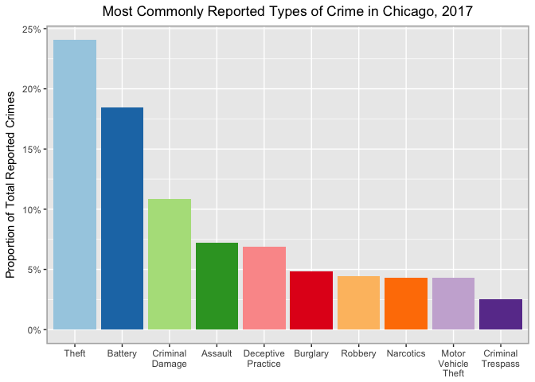

Assignment 1, Create
================
Erin M. Ochoa
2018/04/10

Part II: Critique
=================

Part II: Create
===============

``` r
library(dplyr)
library(ggplot2)
theme_set(theme_grey()) #Because cowplot sets a different default theme
```

``` r
#Downloaded from:
#https://data.cityofchicago.org/Public-Safety/Crimes-2001-to-present-Dashboard/5cd6-ry5g
crimes <- read.csv('~/Google Drive/School/2018 Spring/Data Viz/Assignments/HW1/Crimes_-_2001_to_present.csv')
```

``` r
names(crimes)
head(crimes)
```

``` r
keep <- c('Year','Primary.Type','Arrest','Domestic','Community.Area')
crimes.sub <- crimes[,keep]
crimes.sub <- crimes.sub[(crimes.sub$Year < 2018), ]
write.csv(crimes.sub,'~/Google Drive/School/2018 Spring/Data Viz/Assignments/HW1/crimes_sub.csv',
          row.names = FALSE)
rm(crimes)
```

``` r
crimes.sub <- read.csv('~/Google Drive/School/2018 Spring/Data Viz/Assignments/HW1/crimes_sub.csv')
```

``` r
crimes.sub <- crimes.sub[(crimes.sub$Year == 2017), ]
```

``` r
crimes.sub %>% 
  group_by(Primary.Type) %>%
  summarise(num_rows = length(Primary.Type)) %>%
  data.frame() -> df_crimes

#Keep the 10 most common crimes (excluding the nebulous 'Other Offense' category)
keep_cats <- df_crimes[ order(-df_crimes[2]), ]
keep_cats <- unlist(list(as.character(keep_cats[(1:11), "Primary.Type"])))
keep_cats <- keep_cats[keep_cats != 'OTHER OFFENSE']
```

``` r
#Get count of each type and arrest status
crimes.sub %>% 
  group_by(Primary.Type,Arrest) %>%
  summarise(num_rows = length(Primary.Type)) %>%
  data.frame() -> df.crimes

#Calc prop for each row relative to the whole, then keep 10 most common types
df.crimes$prop <- df.crimes$num_rows / sum(df.crimes$num_rows)
df.crimes.sub <- df.crimes[as.character(df.crimes$Primary.Type) %in% keep_cats, ]
df.crimes.sub$Primary.Type <- factor(df.crimes.sub$Primary.Type, levels = keep_cats)
df.crimes.sub <- df.crimes.sub[ order(df.crimes.sub[3]),]
```

``` r
leg_labels <- tools::toTitleCase(sapply(keep_cats, tolower,USE.NAMES = FALSE))
leg_labels <- gsub(" ", "\n", leg_labels, perl=TRUE)
```

``` r
ggplot(df.crimes.sub,aes(Primary.Type,prop,Arrest)) +
      geom_bar(stat='identity',aes(alpha=as.factor(Arrest),fill=Primary.Type)) +
      theme(legend.position='bottom',legend.title=element_blank(),
            plot.title=element_text(hjust=0.5),
            plot.subtitle = element_text(hjust = 0.5),
            axis.title.x=element_blank(),
            panel.background=element_blank(),
            panel.grid.major.y=element_line(colour='grey50',size=.25),
            panel.grid.major.x=element_blank(),
            axis.ticks=element_blank()) +
      labs(y='Proportion of All 2017 Crimes',
           title='Most Commonly Reported Types of Crime in Chicago, 2017',
           subtitle='Representing 88% of all crimes known to the police. Source: City of Chicago Data Portal') +
      scale_fill_brewer(palette='Paired') + guides(fill=FALSE) +
      scale_alpha_discrete(range=c(.4,1),breaks=c('true','false'),
                           labels=c('Arrest','No Arrest')) + 
      scale_y_continuous(labels=scales::percent_format(),limits=c(0,.25)) +
      scale_x_discrete(labels=leg_labels)
```



What is the story?
------------------

This graph shows the ten most common types of crime known to police in Chicago in the year 2017. With homicide and weapons violations absent from the categories, we see that despite what is portrayed in the media, murder and gun-related offenses must have been relatively rare last year. Robbery, a type of crime about which students, faculty, and staff at the University of Chicago are regularly alerted, was only the seventh most-common crime type. Even less common were known narcotics offenses, though, in contrast to every other represented category, all or nearly all of these resulted in arrest.

Why did you select this graphical form?
---------------------------------------

I chose to use a bar chart for three key reasons: First, a pie chart would have been inappropriate and hard to read; it would have required me to use all crime categories or else present data in a misleading form and the slices would have been tiny. Second, a line chart seemed inappropriate because it would have given the impression that the data were longitudinal, whereas they are cross-sectional. Third, a bar chart lends itself well to splitting categories into subcategories; this feature allowed me to use transparency to represent the share of known crimes per category that did not result in arrest, a decision I will discuss more fully below.

Why did you use these specific channels to encode the data (e.g. spatial position, colors, scale)?
--------------------------------------------------------------------------------------------------

### Spatial position

I chose to make a stacked bar chart instead of a dodged chart because representing crimes in which there was an arrest and those in which there was not as part of the same whole was important. Additionally, using a dodged chart causes a gap in the 'Narcotics' section, something that is distracting and aesthetically displeasing.

### Colors

I removed a lot of chart junk (background color, vertical gridlines, and crime types from the legend) and used aesthetics and custom labels to convey important information. I consulted several sources before deciding that the 'Paired' color scale was best for color-blindness. I added transparency to distinguish cases in which there was an arrest from cases in which there was no arrest, though this was not my first inclination: I originally tried the 'fill' aesthetic to add borders to each section of each bar; the idea was that the border would separate the arrests from the non-arrests. The result was disappointing, so I added transparency, this was an improvement, but the best iteration is the one presented here. Finally, I removed horizontal gridlines and all tick marks, added percent signs to the y-axis, fixed the casing on the category labels, and included descriptive labels for the y-axis, title, and legend categories.

### Scale

The scale was intentionally chosen to represent the relative proportions of the represented crime types to all crimes known to the police in 2017 as opposed to a count of such crimes. Providing a raw count of crimes would draw the reader's attention to the sheer number of crimes reported in 2017, which might seem outrageously large to naive readers who fail to take into account the city's total population when considering the number of crimes. The goal is not to show that Chicago does or does not have a lot of crime, which a count of crimes would suggest; the goal is to show that the vast majority of crimes are not the ones about which residents might spend the most time worrying.

Why did you make any other data transformations?
------------------------------------------------

Data were aggregated to calculate the percentage of crimes in each category relative to all crimes. This is because the goal was to show that the vast majority of crimes known to the police in 2017 were the ones about which we tended to hear the least.

How do these decisions facilitate effective communication?
----------------------------------------------------------

This graph is insightful. We immediately grasp that all or nearly all narcotics cases known to the police resulted in an arrest. Criminal trespass was the only other category in which a majority of reports resulted in an arrest. The vast majority of cases in every other category resulted in no arrests, which means that in 2017, Chicago had a very low clearance rate for the most common types of crimes. After pondering the graph, we realize that the impact of the Chicago police in 2017 was mostly focused on making arrests in cases related to drugs. One wonders whether this is a vital function that justifies the level of funding one imagines the police force receives to support such arrests, not to mention the costs of prosecuting such cases and housing or monitoring those convicted of such offenses.

This graph is enlightening. We see that homicides are so rare that they are not present in the top ten most common types of crime. This might ease residents' anxiety about safety in Chicago.
